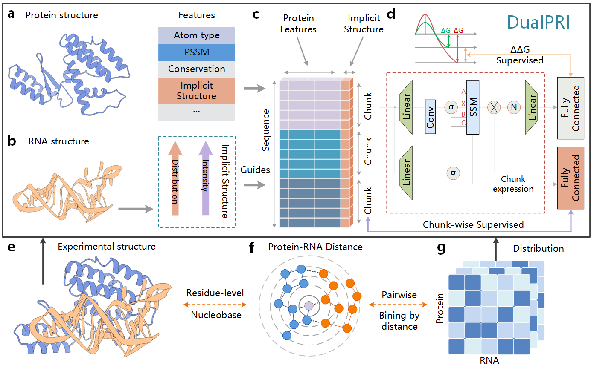

<h1 align="center">
  
</h1>


# DualSSD:  A Dual-Stream State Space Model for Protein-RNA Interaction Prediction

A novel architecture that leverages Mamba2 block-level states for efficient structural prediction in protein-RNA complexes. By extracting and utilizing intermediate states from State Space Models, DualSSD achieves both improved prediction accuracy and enhanced interpretability through attention visualization.

## Key Innovation

**Block-Level State Extraction**: Unlike traditional sequence-only models, DualSSD modifies the Mamba2 source code to return intermediate block-level states, enabling efficient structural information prediction while maintaining linear complexity.

**Dual-Stream Architecture**:

- **Sequence Stream**: Mamba2 processes protein sequences with linear complexity
- **Structure Stream**: Block-level states are mapped to distance encodings via MLP layers

## Architecture Highlights

### 1. Source Code Modification for State Extraction

The core innovation involves minimal invasive modifications to Mamba2's state computation logic:

```python
# Modified import from custom Mamba implementation
from mamba.mamba_ssm.ops.triton.ssd_combined_with_state import mamba_chunk_scan_combined
```

Key modifications:

- Located state computation functions in Mamba source code
- Implemented block-level state return with minimal code changes
- Maintained compatibility with original Mamba architecture
- Preserved linear complexity O(n) for sequence processing

### 2. Structure Prediction via Distance Encoding

Block-level states are processed to predict structural information:

1. **State Extraction**: Obtain chunk-level hidden states from Mamba2
2. **MLP Prediction**: Map states to distance encodings between residues
3. **Multi-Scale Distance**: Predict distances at different granularities (6Å, 8Å, 10Å thresholds)
4. **Joint Training**: Structural prediction loss enhances both accuracy and interpretability

### 3. Interpretability Validation

**Molecular Dynamics Simulation Integration**:

- Performed all-atom MD simulations using NAMD (learned from scratch in 2 weeks)
- Extracted conformational changes from 100ns trajectories
- Compared attention patterns with structural dynamics

**Attention Visualization**:

- Visualized model attention on mutation-affected regions
- Discovered attention patterns correlate with conformational changes
- Validated that the model focuses on structurally relevant residues

## Data Preparation

### Dataset Structure

The dataset for protein-RNA interaction prediction is organized as follows:

```
dataset_process/
├── dataset/
│   └── protein_rna_dataset.pkl    # Main dataset file
├── Dataset/
│   ├── S394.csv                   # Mutation annotations
│   ├── S394_pdbs/                 # PDB structure files
│   ├── PSSM_394/                  # Sequence profiles
│   ├── cons_s394/                 # Conservation scores
│   └── Sequence_394/              # FASTA sequences
└── processed_pdbs/
    ├── protein_chains/            # Separated protein chains
    └── nucleic_chains/            # Separated RNA chains
```

### Structure Acquisition

1. **Wild-type PDB files**: Download from RCSB PDB database

   ```bash
   wget https://files.rcsb.org/download/1AUD.pdb
   ```

2. **Mutant structures**: Generate using FoldX

   ```bash
   # Repair wild-type structure
   foldx --command=RepairPDB --pdb=1AUD.pdb
   
   # Build mutant (e.g., A10G mutation)
   # individual_list.txt: AA10G;
   foldx --command=BuildModel --pdb=1AUD_Repair.pdb --mutant-file=individual_list.txt
   ```

### Feature Extraction Pipeline

#### 1. Sequence Features

```bash
# Generate PSSM profiles using PSI-BLAST
psiblast -db swissprot -query protein.fasta -num_iterations 3 -out_ascii_pssm protein.pssm

# Process PSSM files
python dataset_process/pssm.py

# Calculate conservation scores
python dataset_process/conservation.py
```

#### 2. Chain Separation (for Protein-RNA Complexes)

```bash
# Separate protein and RNA chains
python dataset_process/separate.py
```

## Model Architecture

### Mamba2 with Block-Level State Extraction

The modified Mamba2 architecture:

```python
# Custom Mamba module with state extraction
mamba/
├── mamba_ssm/
│   ├── modules/
│   │   └── mamba2_simple.py          # Modified Mamba2 module
│   └── ops/
│       └── triton/
│           ├── ssd_combined.py        # Original implementation
│           └── ssd_combined_with_state.py  # Modified for state extraction
```

Key parameters in `config.py`:

- `DEFAULT_CHUNK_SIZE`: 64 (chunk size for state computation)
- `USE_BIDIRECTIONAL`: True (bidirectional Mamba processing)
- `DISTANCE_THRESHOLDS`: [6, 8, 10, ...] (multi-scale distance prediction)

### DualSSD Model

```python
from model.DualSSD import DualSSD

model = DualSSD(
    protein_channels=41,      # Protein feature dimension
    rna_channels=5,           # RNA feature dimension
    hidden_channels=64,       # Hidden layer dimension
    num_layers=3,             # Number of Mamba layers
    chunk_size=64,            # SSD chunk size
    dropout=0.1
)
```

## Training

### Basic Training

```bash
# Train DualSSD model
python main.py \
    --model dualssd \
    --data_path ./dataset_process/dataset/protein_rna_dataset.pkl \
    --batch_size 16 \
    --learning_rate 0.0008 \
    --epochs 300 \
    --chunk_size 64 \
    --feature_type 3  # 0=base, 1=distribution, 2=intensity, 3=full features
```

### Advanced Options

```bash
# Training with full features and attention visualization
python main.py \
    --model dualssd \
    --feature_type 3 \
    --chunk_size 64 \
    --batch_size 16 \
    --learning_rate 0.0008 \
    --epochs 300 \
    --patience 40 \
    --split_strategy pdb_limited \  # 2 samples per PDB for robust evaluation
    --cache_dir ./contact_cache \   # Cache multi-scale contact features
    --output_dir ./output \
    --experiment_name dualssd_full
```

Key training parameters:

- `--feature_type`: Multi-scale feature configuration
  - 0: Base features only
  - 1: + Distance distribution features
  - 2: + Contact intensity features
  - 3: Full features (distribution + intensity)
- `--chunk_size`: Chunk size for Mamba2 state computation
- `--split_strategy`: Data splitting strategy (random/pdb_limited/train_ratio)
- `--force_recompute`: Force recompute cached contact features

### Molecular Dynamics Simulation Validation

To validate model interpretability with MD simulations:

1. **Run MD simulation** (100ns, NPT ensemble)
2. **Extract conformational changes** from trajectories
3. **Generate attention heatmaps** from trained model
4. **Compare patterns**: Attention vs. structural dynamics

Example visualization workflow:

```python
# Extract attention weights
attention_weights = model.get_attention_maps(data)

# Compare with MD-derived conformational changes
correlation = compare_attention_with_md(attention_weights, md_trajectory)
```

## Model Evaluation

### Prediction Metrics

The model is evaluated using:

- **PCC (Pearson Correlation Coefficient)**: Measures linear correlation
- **RMSE (Root Mean Square Error)**: Prediction accuracy
- **MAE (Mean Absolute Error)**: Average prediction error

### Results

**Protein-RNA Complex Prediction**:

- PCC: 0.73 (vs SOTA 0.66)
- Demonstrates improved accuracy through structural information integration

**Interpretability Validation**:

- Attention patterns correlate with MD-simulated conformational changes
- Model focuses on mutation-affected regions
- Validates structural awareness of the model

## Project Structure

```
DualSSD/
├── main.py                          # Main training script
├── config.py                        # Configuration file
├── trainer.py                       # Training utilities
├── model_factory.py                 # Model creation factory
├── utils.py                         # Utility functions
├── mamba/                          # Modified Mamba2 source code
│   └── mamba_ssm/
│       ├── modules/
│       │   └── mamba2_simple.py
│       └── ops/
│           └── triton/
│               └── ssd_combined_with_state.py  # Key modification
├── model/
│   ├── DualSSD.py                  # Main model architecture
│   └── utils/
│       └── loader/
│           └── enhanced_contact_data_loader.py  # Data loading with contact features
├── dataset_process/
│   ├── processed_pdbs/             # Chains
│   ├── pssm.py                     # PSSM processing
│   ├── conservation.py             # Conservation score calculation
│   ├── dataset_simplified.py       # Dataset
│   └── separate.py                 # Chain separation
└── dataset/
    ├── S394.csv                    # Mutation annotations
    └── protein_rna_dataset.pkl     # Processed dataset
```

## Key Features

1. **Linear Complexity**: Maintains O(n) complexity while incorporating structural information
2. **Minimal Source Modification**: Only essential changes to Mamba2 core functions
3. **Multi-Scale Contacts**: Considers interactions at multiple distance thresholds
4. **Interpretability**: Attention visualization reveals structural awareness
5. **Validated by MD**: Confirmed through molecular dynamics simulations

## Contact

For questions and feedback, please contact: chenrui3074@stu.ouc.edu.cn

## Acknowledgments

- Mamba: https://github.com/state-spaces/mamba
- NAMD: https://www.ks.uiuc.edu/Research/namd/
- FoldX: http://foldxsuite.crg.eu/

## License

This project is licensed under the MIT License - see the LICENSE file for details.

---

**Note**: This work represents a novel approach to incorporating structural information into state space models while maintaining computational efficiency. The key innovation—extracting block-level states for structural prediction—opens new possibilities for interpretable deep learning in structural biology.
